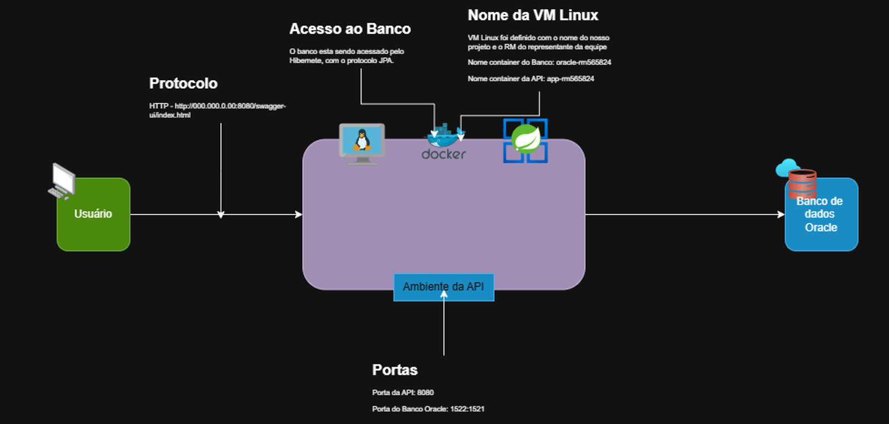

# 🚀 AstroColony Logistics API

Sistema desenvolvido para gerenciamento de missões espaciais, tripulantes, diretores de voo e controle de recursos alimentares. A aplicação foi construída utilizando Java 21, Spring Boot, Oracle Database, Docker, Docker Compose e Microsoft Azure Cloud, seguindo boas práticas de desenvolvimento Back-End, arquitetura em camadas e conceitos DevOps.

---

# 📋 Objetivo do Projeto

A AstroColony Logistics API tem como objetivo fornecer uma solução para gerenciamento logístico de missões espaciais, permitindo:

- Cadastro e gerenciamento de missões espaciais
- Controle de tripulantes
- Controle de diretores de voo
- Gerenciamento de estoque de alimentos
- Controle de status das missões
- Persistência de dados em banco Oracle
- Documentação automática da API via Swagger/OpenAPI
- Execução em ambiente Docker hospedado em nuvem Azure

A solução foi desenvolvida como parte da disciplina **DevOps Tools & Cloud Computing**, utilizando containers Docker integrados através do Docker Compose e executados em uma Máquina Virtual Linux hospedada na Azure.

---

# 🏛 Arquitetura da Solução

A aplicação é composta por dois containers Docker:

### Container da Aplicação

- Spring Boot API
- Java 21
- Usuário não privilegiado (`astro`)
- Porta 8080 exposta
- Comunicação com Oracle via rede Docker

### Container do Banco de Dados

- Oracle Database Free
- Persistência de dados utilizando Volume Nomeado
- Porta 1521 exposta
- Comunicação com a API através da rede Docker

### Componentes da Solução

- Usuário
- Azure Virtual Machine Linux
- Docker Compose
- Container da API Spring Boot
- Container Oracle Database
- Docker Network (`astro-network`)
- Volume Nomeado (`oracle_data`)

## Diagrama da Arquitetura



---

# 🛠 Tecnologias Utilizadas

- Java 21
- Spring Boot
- Spring Data JPA
- Hibernate
- Maven
- Oracle Database Free
- Docker
- Docker Compose
- Swagger / OpenAPI
- Azure Virtual Machine
- Linux Ubuntu

---

# 📂 Estrutura do Projeto

```text
.
├── src
│   ├── main
│   └── test
├── Dockerfile
├── docker-compose.yml
├── pom.xml
├── azure-vm-linux.ps1
├── img.png
└── README.md
```

---

## Docker Compose

```yaml
services:

  oracle-rm565824:
    image: gvenzl/oracle-free:latest
    container_name: oracle-rm565824
    restart: always

    ports:
      - "1522:1521"

    environment:
      ORACLE_PASSWORD: 120306

    volumes:
      - oracle_data:/opt/oracle/oradata

    healthcheck:
      test: ["CMD-SHELL", "healthcheck.sh"]
      interval: 30s
      timeout: 10s
      retries: 10
      start_period: 120s

    networks:
      - astro-network

  app-rm565824:
    build: .
    container_name: app-rm565824
    restart: always

    depends_on:
      oracle-rm565824:
        condition: service_healthy

    ports:
      - "8080:8080"

    environment:
      USER_DB_ORACLE: system
      PASSWORD_DB_ORACLE: 120306

    networks:
      - astro-network

volumes:
  oracle_data:

networks:
  astro-network:
    driver: bridge
```
---

## Docker File

```dockerfile
FROM maven:3.9.9-eclipse-temurin-21 AS build

WORKDIR /app

COPY pom.xml .
COPY src ./src

RUN mvn clean package -DskipTests

FROM eclipse-temurin:21-jre

RUN useradd -m astro

WORKDIR /home/astro/app

COPY --from=build /app/target/*.jar app.jar

ENV USER_DB_ORACLE=system
ENV PASSWORD_DB_ORACLE=Oracle123

USER astro

EXPOSE 8080

ENTRYPOINT ["java","-jar","app.jar"]
```


---

# ⚙️ Configuração da Aplicação

A aplicação utiliza as seguintes variáveis de ambiente:

| Variável | Descrição |
|-----------|-----------|
| USER_DB_ORACLE | Usuário Oracle |
| PASSWORD_DB_ORACLE | Senha Oracle |

Linux:

```bash
export USER_DB_ORACLE=system
export PASSWORD_DB_ORACLE=120306
```

Windows PowerShell:

```powershell
$env:USER_DB_ORACLE="system"
$env:PASSWORD_DB_ORACLE="120306"
```

---

# 🐳 Containers da Solução

## Container da Aplicação

Container responsável pela execução da API Spring Boot.

### Características

- Imagem personalizada criada através do Dockerfile
- Usuário não privilegiado (`astro`)
- Diretório de trabalho definido
- Variáveis de ambiente configuradas
- Porta 8080 exposta
- Comunicação com Oracle Database

Nome do Container:

```text
app-rm565824
```

---

## Container Oracle Database

Container responsável pela persistência dos dados.

### Características

- Oracle Database Free
- Porta 1521 exposta
- Volume nomeado
- Variáveis de ambiente
- Persistência dos dados

Nome do Container:

```text
oracle-rm565824
```

---

## Docker Network

Rede compartilhada entre os containers:

```text
astro-network
```

---

## Volume Nomeado

Persistência do banco Oracle:

```text
oracle_data
```

Volume criado automaticamente:

```bash
docker volume ls
```

Resultado esperado:

```text
globalsolution-cloud_oracle_data
```

---

# ⚙️ Pré-requisitos

Para executar o projeto localmente é necessário possuir:

- Java 21
- Maven 3.9+
- Docker
- Docker Compose

Verificar instalações:

```bash
java -version
mvn -version
docker --version
docker compose version
```

---

# ▶️ Executando Localmente

## Clonar o Repositório

```bash
git clone https://github.com/2TDSPO-JPG/GlobalSolution-Cloud.git
```

Entrar no projeto:

```bash
cd GlobalSolution-Cloud
```

---

## Compilar o Projeto

```bash
mvn clean package
```

---

## Executar a Aplicação

Linux:

```bash
java -jar target/*.jar
```

Windows:

```powershell
java -jar target\*.jar
```

---

# 🐳 Executando com Docker

## Build da Imagem

```bash
docker build -t astrocolony-api .
```

---

## Executar Container

```bash
docker run -d \
-p 8080:8080 \
--name astrocolony-api \
astrocolony-api
```

---

## Verificar Execução

```bash
docker ps
```

---

## Ver Logs

```bash
docker logs -f astrocolony-api
```

---

# 🐳 Executando com Docker Compose

Subir containers:

```bash
docker compose up -d --build
```

---

Verificar containers:

```bash
docker ps
```

---

Ver logs da aplicação:

```bash
docker logs app-rm565824
```

---

Ver logs do banco:

```bash
docker logs oracle-rm565824
```

---

Parar containers:

```bash
docker compose down
```

---

Remover containers e volumes:

```bash
docker compose down -v
```

---

# ☁️ Deploy na Azure

## 1. Login Azure

```powershell
az login
```

---

## 2. Criar Resource Group

```powershell
az group create `
--name rg-astrocolony `
--location brazilsouth
```

---

## 3. Criar Máquina Virtual Linux

```powershell
az vm create `
--resource-group rg-astrocolony `
--name vm-astrocolony `
--image Ubuntu2204 `
--admin-username azureuser `
--generate-ssh-keys
```

---

## 4. Liberar Porta SSH

```powershell
az vm open-port `
--resource-group rg-astrocolony `
--name vm-astrocolony `
--port 22
```

---

## 5. Liberar Porta da Aplicação

```powershell
az vm open-port `
--resource-group rg-astrocolony `
--name vm-astrocolony `
--port 8080
```

---

## 6. Conectar na VM

```bash
ssh azureuser@IP_DA_VM
```

---

# 🐧 Configuração da VM Linux

Atualizar pacotes:

```bash
sudo apt update
sudo apt upgrade -y
```

---

Instalar Git:

```bash
sudo apt install git -y
```

---

Instalar Docker:

```bash
sudo apt install docker.io docker-compose-v2 -y
```

---

Adicionar usuário ao grupo Docker:

```bash
sudo usermod -aG docker $USER
```

---

Aplicar permissões:

```bash
newgrp docker
```

---

Validar instalação:

```bash
docker --version
docker compose version
```

---

# 📥 Publicando o Projeto na VM

## Clonar Repositório

```bash
git clone https://github.com/2TDSPO-JPG/GlobalSolution-Cloud.git
```

Entrar no projeto:

```bash
cd GlobalSolution-Cloud
```

---

## Subir Containers

```bash
docker compose up -d --build
```

---

Verificar containers:

```bash
docker ps
```

---

# 📖 Swagger

Após a aplicação estar em execução:

```text
http://localhost:8080/swagger-ui/index.html
```

Em ambiente Azure:

```text
http://IP_DA_VM:8080/swagger-ui/index.html
```

---

# 📡 Principais Endpoints

## Missões

| Método | Endpoint |
|----------|----------|
| GET | /missoes |
| GET | /missoes/{id} |
| POST | /missoes |
| PUT | /missoes/iniciar-missao/{id} |
| DELETE | /missoes/{id} |

---

## Tripulantes

| Método | Endpoint |
|----------|----------|
| POST | /tripulantes |
| POST | /tripulantes/login |
| GET | /tripulantes/buscar-por-pin/{pin} |
| GET | /tripulantes/buscar-por-status/{status} |
| PUT | /tripulantes/mudar-status |
| DELETE | /tripulantes/deletar-por-pin/{pin} |

---

## Diretor de Voo

| Método | Endpoint |
|----------|----------|
| GET | /diretor-voo |
| POST | /diretor-voo |
| POST | /diretor-voo/login |
| PUT | /diretor-voo/alterar-status/{id}-{status} |

---

## Alimentos

| Método | Endpoint |
|----------|----------|
| GET | /alimentos |
| POST | /alimentos |
| PUT | /alimentos |
| DELETE | /alimentos |

---

# 🔍 Evidências da Atividade

## Containers em Execução

```bash
docker ps
```

---

## Logs dos Containers

```bash
docker logs app-rm565824

docker logs oracle-rm565824
```

---

## Acessando o Container da Aplicação

```bash
docker exec -it app-rm565824 sh

whoami

pwd

ls -l
```

Resultado esperado:

```text
astro
/home/astro/app
```

---

## Acessando o Container Oracle

```bash
docker exec -it oracle-rm565824 bash

whoami

pwd

ls -l
```

---

# 💾 Evidência de Persistência

Verificar volume:

```bash
docker volume ls
```

---

Inspecionar volume:

```bash
docker volume inspect globalsolution-cloud_oracle_data
```

---

Acessar Oracle:

```bash
docker exec -it oracle-rm565824 bash

sqlplus system/120306@FREEPDB1
```

---

Listar tabelas:

```sql
SELECT table_name
FROM user_tables;
```

---

Consultar dados:

```sql
SELECT * FROM T_MISSAO;

SELECT * FROM T_TRIPULANTE;

SELECT * FROM T_DIRETOR_VOO;

SELECT * FROM T_ALIMENTO;
```

---

# 🔄 Teste de Persistência

Parar containers:

```bash
docker compose down
```

Subir novamente:

```bash
docker compose up -d
```

Executar novamente os comandos SELECT para comprovar a persistência dos dados armazenados no volume Oracle.

---

# 🧪 Testando a Aplicação

Swagger:

```text
http://IP_DA_VM:8080/swagger-ui/index.html
```

Exemplo:

```bash
curl http://localhost:8080/swagger-ui/index.html
```

---

# 🛑 Parando a Aplicação

```bash
docker compose down
```

---

# 🗑️ Removendo Ambiente Completo

```bash
docker compose down -v

docker system prune -a -f
```

---

# ☁️ Removendo Recursos da Azure

Remover apenas a VM:

```powershell
az vm delete `
--resource-group rg-astrocolony `
--name vm-astrocolony
```

---

Remover todo o ambiente:

```powershell
az group delete `
--name rg-astrocolony `
--yes `
--no-wait
```

---

# 👨‍💻 Desenvolvedor

Pedro Ferreira — RM565824  
2TDSPO — FIAP

---

# 📄 Licença

Projeto desenvolvido para fins acadêmicos, demonstração de conhecimentos em Java, Spring Boot, Oracle Database, Docker, DevOps e Computação em Nuvem.